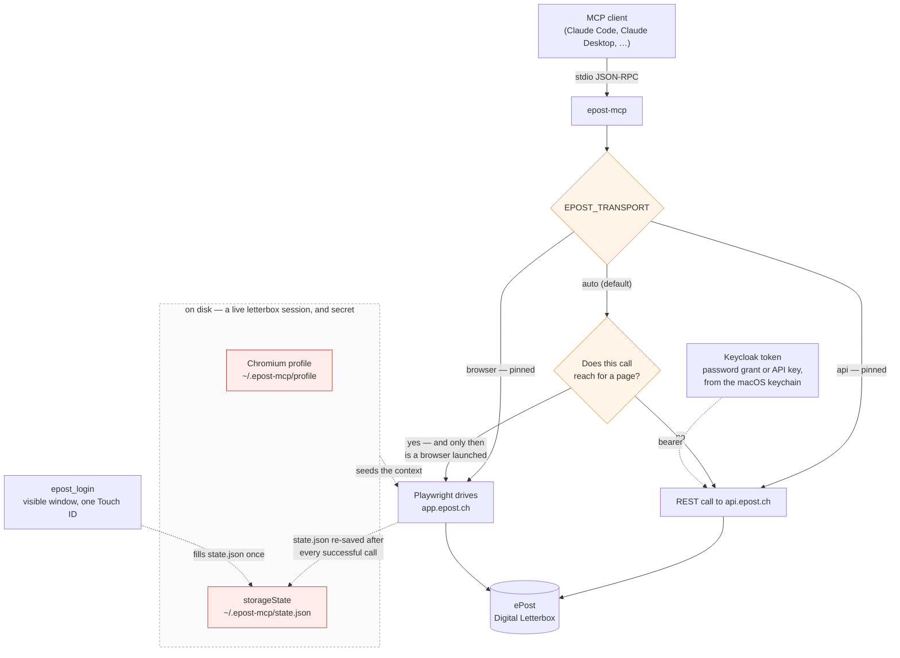

<div align="center">

# epost-mcp

Read, download and archive your Swiss **ePost** digital letterbox — over the documented public API, with browser automation as a fallback.

[](https://www.npmjs.com/package/epost-mcp)
&nbsp;
[](https://github.com/sapn95/epost-mcp/actions/workflows/ci.yml)
&nbsp;
[](https://nodejs.org)
&nbsp;
[](LICENSE)

</div>

---

> **Unofficial.** Not affiliated with ePost or Swiss Post. It speaks their
> documented public API where it can and falls back to driving the web portal
> where it cannot — that fallback is inherently fragile, since portal updates
> break selectors without warning. Use it for **your own** letterbox and respect
> the provider's terms of service.

An [MCP](https://modelcontextprotocol.io) server for the Swiss **ePost** digital
letterbox ([app.epost.ch](https://app.epost.ch)). It lets an MCP client (Claude
Code, Claude Desktop, …) **list and download your scanned letters** and do basic
housekeeping in the ePost **Storage** area — folders and moving documents.

ePost does publish a [public API](https://developer.epost.ch/) for the Digital
Letterbox, and a private tenant can use it — see *Transport* below. That is the
preferred path: no browser, no session, and letters arrive with a real sender
description. Browser automation via Playwright remains for the few things the
API does not cover.

## How a call gets answered

Two ways in, and the server picks per call rather than per session — so the
same conversation can read a letter over the API and archive it in the browser
without you arranging anything. `EPOST_TRANSPORT` pins that choice if you would
rather it did not move.



A pin is enforced both ways. Pinned to `api`, a browser-only tool is refused
rather than quietly redirected — the point of pinning is knowing what ran.

## Prerequisites

- **Node.js ≥ 20.19**
- A Chromium managed by Playwright
- A Swiss **ePost** account with the Scanning-Service, reachable via **SwissID**

```bash
git clone https://github.com/sapn95/epost-mcp.git
cd epost-mcp
npm install
npx playwright install chromium   # downloads the browser Playwright drives
```

## Session / login model

The hard part of ePost automation is the login. This server keeps you logged in
so you do **not** re-authenticate on every call or every restart:

- The SwissID/ePost session is cached as a Playwright **storageState** file at
  `~/.epost-mcp/state.json` (49 cookies incl. the KLARA/Keycloak SSO cookies).
- On startup the server loads that file, so a previously logged-in session is
  reused **across server restarts**.
- After a successful `epost_login` **and after every successful tool call**, the
  server re-saves `state.json`, keeping the cached session fresh.
- `epost_login` opens a **visible** (headed) browser window so you complete the
  SwissID login (incl. 2FA) yourself. Every other tool runs **headless**.
- SwissID sessions are short-lived. When the session expires, tools return
  `login_required` — just run `epost_login` again.

First-time / after-expiry flow:

1. Call `epost_status`. If it returns `login_required`…
2. …call `epost_login`. A browser window opens on app.epost.ch. Complete the
   SwissID login until you see your dashboard / the letterbox. The session is
   then cached to `~/.epost-mcp/state.json`.
3. Use `epost_list_letters`, `epost_download_letter`, etc. headlessly.

> **Security:** `~/.epost-mcp/state.json` contains **live session cookies** for
> your ePost/SwissID account. Treat it like a password. It is **git-ignored** in
> this repo and must **never** be committed, shared, or synced to a cloud folder.
> Delete it to force a fresh login. Override its location with `EPOST_STATE`.

## Transport: the public API, with the browser as fallback

ePost publishes a REST API for the Digital Letterbox, and **a private tenant can
use it** — which is easy to miss, because the developer portal is written for
business clients. The API is preferred for everything it covers; browser
automation runs only when it cannot serve a call.

Set it up once:

1. Log in to app.epost.ch with SwissID as usual.
2. In the **same browser**, open `https://login.epost.ch/auth/realms/klara/account/`
   → *Authentication* → *Set/update password*, and set one. A SwissID login has
   no password of its own, which is the whole point of this step.
3. Store it: `security add-generic-password -a epost -s epost-mcp-api-password -w -U` — `-w` with no
   value prompts, so the password never reaches your shell history or a process listing.
   (or set `EPOST_API_PASSWORD`). The account e-mail comes from the same place as
   before.

Documented at
[How to access the letterbox public APIs with a private tenant](https://developer.epost.ch/docs/api-docs/v6nqmmjkxcery-how-to-access-the-letterbox-public-ap-is-with-a-private-tenant).

### Why it is worth it

Measured against the same account:

| | Browser | API |
| --- | --- | --- |
| List the inbox | tens of seconds, needs a live session | ~2s, no session at all |
| What a letter says | `Gescannter Brief` for every scan | a real `description` ("Invoice from …") and `documentTypes` |
| Storage listing | 48 cards at a time, scrolled | every document in one call |
| Archiving | two-step folder sheet | one `PATCH` |

That second row is the one that matters: the portal renders every scan with the
same title, so an archived document could not be classified without opening it.
The API has carried the sender all along.

### What the API does not do

There is **no endpoint to move a document that is already in Storage** between
folders. `PATCH /letters/{id}/archive` is inbox → folder only and answers `400`
for anything already archived — the documentation says so explicitly. Re-filing
therefore falls back to the browser.

A useful division follows from that: **the browser acts, the API checks.** The
move itself is not verified for you — `epost_move_to_folder` reports what the
portal accepted, not what it ended up holding. Run
`epost_list_storage_documents` afterwards and the API says which document id is
in which folder, which matters because Storage cards show only a date, and dates
repeat.

### Auth: two schemes, both supported

The API documents an **API key** and **Bearer** auth, and this server does both.

**Password grant** (what the private-tenant guide describes):

```
POST /core/latest/tenants   {username, password}                     -> tenant_id, company_id
POST /core/latest/token     {username, password, grant_type=password,
                             tenant_id, company_id}                  -> access_token (600s)
GET  /epost/v2/letters      Authorization: Bearer …
```

It re-authenticates a minute before expiry rather than tracking refresh tokens:
the password is already at hand, so a refresh buys nothing.

**API key**, as an alternative or in addition:

```bash
# -w with no value prompts, so the key stays out of shell history and argv
security add-generic-password -a epost -s epost-mcp-api-key -w -U
# or: export EPOST_API_KEY=<key>
```

Sent as `X-API-KEY`. A key on its own is a complete credential — the password
grant is then skipped entirely, which is the simpler setup if you have one. When
both are configured the key travels alongside the token, matching the portal's
own examples.

`epost_settings` reports which of the two are in play.

### Choosing the transport

`EPOST_TRANSPORT` is `auto` by default: the API answers whatever it can, the
browser takes the rest. Pin it to `api` or `browser` to diagnose a result, or to
force the browser for the one thing only it can do.

## Login: one fingerprint, nothing else

`epost_login` drives every step of the SwissID chain that does not need a human
and stops at the only one that does — the biometric prompt:

```
app.epost.ch → login.epost.ch     clicks "Login mit SwissID"
             → login-email         fills your account e-mail, "Weiter"
             → confirm-passkey     "Weiter"   → macOS asks for Touch ID   ← you
             → app.epost.ch, authenticated; session cached
```

Measured end to end: **19 seconds**, one fingerprint, no password and no SMS
code. Two things have to be in place:

1. **A passkey on your SwissID account**, created normally in Safari or Chrome
   (`account.swissid.ch` → Login-Einstellungen). Apple's authenticator is
   accepted; see the note below for why a software one is not.
2. **A signed browser.** Playwright's bundled Chromium is an unsigned test build
   and reports `isUserVerifyingPlatformAuthenticatorAvailable() === false`, so
   Touch ID is never offered and SwissID falls back to password + SMS. Installed
   Google Chrome reports `true`. The server therefore prefers a signed system
   browser automatically — `chrome`, `chrome-canary`, `edge`, `brave`, in that
   order — and falls back to the bundled Chromium. Override with `EPOST_BROWSER`.

Tell it which account to fill in, either way:

```bash
security add-generic-password -a epost -s epost-mcp-swissid-user \
  -w 'you@example.com' -U          # or: export EPOST_SWISSID_USER=you@example.com
```

`epost_settings` prints what was resolved — browser, passkey capability, paths,
and whether the account e-mail is configured. Run it first if a login surprises
you.

### Why the login is not fully unattended

Everything except the biometric prompt is driven. That is the ceiling, not a
shortcoming of the implementation: a passkey cannot be used without genuine user
presence.

The tempting shortcut — a *software* passkey through Chrome's WebAuthn virtual
authenticator, so the server could sign the login itself — was built, tried, and
removed. SwissID rejects software authenticators outright:

```text
POST /api-login/authenticate/webauthn-register  ->  400
ERROR::WebauthnVendorNotAllowed
```

It was removed rather than kept "just in case": it could never work against the
one service this server talks to, and it wrote an exportable private key into
the login keychain — a standing risk in exchange for nothing.

## Register in Claude Code

Use an **absolute** path to `index.js`:

```bash
claude mcp add epost --scope user -- node /absolute/path/to/epost-mcp/index.js
```

Or add it directly to `~/.claude.json`:

```json
{
  "mcpServers": {
    "epost": {
      "command": "node",
      "args": ["/absolute/path/to/epost-mcp/index.js"]
    }
  }
}
```

(Claude Desktop uses the same shape in its `claude_desktop_config.json`.)

## Tools

| Tool | Params | Returns |
| --- | --- | --- |
| `epost_status` | — | `{ status: "ok" \| "login_required" }` |
| `epost_login` | `wait_seconds` (optional, default 300) | Opens a visible window and drives the SwissID chain up to the Touch ID prompt. `{ status, browser, message }` |
| `epost_settings` | — | Resolved browser + why, Touch ID capability, paths, whether the account e-mail is set |
| `epost_list_letters` | `limit` (optional, API only) | `{ transport, count, letters[] }`, newest first. Over the API a letter carries `id`, a real `sender` description, `documentTypes` and `read`; over the browser fallback `sender`, `title`, `date`, `dates` and a `preview`. `truncated: true` when the window was filled |
| `epost_download_letter` | `output_dir` (required); `index` **or** `letter_id` (API only) | `{ saved }`, written `0600` — `YYYY-MM-DD_ePost_<letter id>.pdf` over the API, `_<index>.pdf` over the browser fallback, which has no id to name it by. An index is a position in a list that renumbers itself after every store, so two calls a day apart can mean two different letters |
| `epost_download_all` | `output_dir` (string) | `{ count, saved[] }` — every letter downloaded |
| `epost_store_letter` | `folder` (required); exactly one of `index`, `title`, `letter_id` | **Archive**: takes the letter out of the inbox into that Storage folder. Not a delete. `{ stored, folder }` — or `{ status: "refused" }` when the portal would not accept the folder sheet, which it signals by leaving it open and nothing else. A `title` is matched against the first 200 letters only, so on a longer inbox it is refused rather than guessed at; a refusal from the service itself is reported however the letter was addressed, and not retried through the portal |
| `epost_search` | `keyword`; `location` (`ALL`\|`INBOX`\|`STORAGE`), `limit` | **Full-text search inside the letters.** API only — the portal offers nothing like it. |
| `epost_get_letter` | `letter_id` | One letter: sender description, document types, dates, read status |
| `epost_unread_count` | — | `{ unread }` |
| `epost_set_read_status` | `letter_ids[]`, `status` (`READ`\|`UNREAD`) | Mark letters read or unread. `accepted` counts the ids that were **sent**: the endpoint answers with an empty 204 and never names the ones it recognised, so an id that no longer exists is counted too |
| `epost_list_deleted` | — | Trash, with days remaining before permanent removal |
| `epost_restore_letter` | `letter_id` | Restore a deleted letter to the inbox |
| `epost_delete_letter` | `letter_id`, `confirm: true` | ⚠️ Moves a letter to the trash. Gated behind `confirm`; to file something away use `epost_store_letter` instead |
| `epost_download_thumbnail` | `letter_id`, `output_path` | Thumbnail image — eyeball a document without fetching the PDF |
| `epost_list_storage` | — | `{ folders[], companyFolders[] }` — your **Custom** folders kept apart from the branded ones the service maintains, which the move sheet will never accept as a destination. Over the API a folder carries its `id`; the browser fallback adds `myDocuments` and `url` |
| `epost_list_storage_documents` | `folder_id`, `limit` (API only); `scroll_all` (browser) | `{ transport, count, documents[] }`. `storedIn` is the folders a document is in, `null` when it is in none, and **absent when membership could not be established** — three different answers. `scroll_all:true` lazy-loads every card on the browser path |
| `epost_read_storage_document` | exactly one of `index`, `title`, `letter_id` (API only); `folder_id` (API only) scopes the lookup; `limit` (API only); `output_dir` (optional) | Opens one Storage document: real sender/subject, document type, date, amount, folder — and saves the PDF when `output_dir` is given. The only way to classify an archived document, since the card list only ever says "Gescannter Brief". Over the API the document is resolved against at most `limit` of Storage (default 1000), and a lookup that misses says whether that window came back full rather than calling the document missing. Over the portal it is `{ status: "refused" }` when the viewer never opened, rather than a metadata scan of the page behind it. |
| `epost_create_folder` | `name` (string) | `{ created }` — or `{ status: "refused", reason }` for a name the portal will not take, which it signals by leaving the dialog open with its complaint in it |
| `epost_move_to_folder` | `folder` (required); `index` or `title`; `remove_from` (optional) | Files a Storage document into a folder. `remove_from` unticks the old folder in the same sheet — the only way to empty one. `{ status: "refused" }` when the sheet is still standing once the portal has had its say |
| `epost_unfile_from_folder` | `folder` (required); `index` or `title` | Removes a folder membership. Only works while the document is in more than one folder (see below). |

### Notes on the Storage tools

The Storage area (`LetterStorage`) has auto **Companies** folders (grouped by
sender, e.g. ePost / la Mobilière), your **Custom** folders, and the master
**My Documents (N)** list. `epost_list_storage` returns your Custom folders and
the My-Documents count; `epost_list_storage_documents` enumerates the individual
documents (each only exposes a date + a `Stored in <folder>` tag once filed).

### Archiving a letter (`epost_store_letter`)

`Store` in the card menu is a **two-step** action: it opens a *Select a folder*
sheet carrying its own Store button, greyed out until a folder is ticked. That is
why a folder argument is required — without one the sheet cannot commit, and
stopping after the first click archives nothing while leaving an invisible
overlay that swallows every later click.

Three things inside that sheet make a folder that is plainly there look absent,
all of them handled now but worth knowing if it ever regresses:

- `.brand-container` also matches the letter cards *behind* the sheet, so the
  lookup has to be scoped to the sheet element.
- The tiles sit in a horizontally scrolling strip, so filtering on visibility
  drops every folder off to the right.
- Folder names must be compared **NFC-normalised**: a name with an umlaut is NFC
  on one side and NFD on the other, and a byte-exact compare never matches.

**ePost folders are additive labels, not physical locations.** *My Documents*
always lists every document; filing simply adds a folder membership (a document
can belong to several folders at once). `epost_move_to_folder` reflects this: it
opens the document's `…` menu → *Move* → ticks the target folder → confirms, and
is **idempotent** — a no-op if the document is already in that folder, and it
never removes an existing membership. Two consequences worth knowing:

- Filing bumps a document to the top of the *Last used* order, so **re-list
  before addressing the next document by `index`** (indices shift after a move).
- The portal's *Move* sheet will not commit an **empty** folder set, so a
  document that is in exactly one folder cannot be returned to "unfiled" through
  this flow — you can only re-file it elsewhere (or delete it) in the ePost UI.
  In other words, **filing is effectively one-way**; get the target right first.

## Environment variables

| Variable | Default | Purpose |
| --- | --- | --- |
| `EPOST_TRANSPORT` | `auto` | `auto` \| `api` \| `browser`. A pin is enforced both ways: pinned to `api`, a browser-only tool is refused rather than quietly redirected |
| `EPOST_API_PASSWORD` | keychain `epost-mcp-api-password` | Password for the password grant. **Secret.** |
| `EPOST_API_KEY` | keychain `epost-mcp-api-key` | Sent as `X-API-KEY`, instead of or alongside the password. **Secret.** |
| `EPOST_SWISSID_USER` | keychain `epost-mcp-swissid-user` | Account e-mail: the API username, and what the login fills in |
| `EPOST_BROWSER` | first signed system browser found | `chrome` \| `chrome-canary` \| `edge` \| `brave` \| `chromium` \| absolute path. `EPOST_CHROMIUM` is accepted as the older name for it |
| `EPOST_STATE` | `~/.epost-mcp/state.json` | Cached session (storageState). **Secret**, written `0600` |
| `EPOST_PROFILE` | `~/.epost-mcp/profile` | Persistent browser profile. It holds the same session in Chromium's own store, so it is **just as secret**; created `0700` |
| `EPOST_API_BASE` | `https://api.epost.ch` | API host — overridable for tests |
| `EPOST_APP_URL` | `https://app.epost.ch` | Portal base — overridable for tests |
| `EPOST_DEBUG` | unset | `1` traces the login steps on stderr |
| `EPOST_WAIT_SCALE` | `1` | Scales the fixed pauses that let the portal repaint, and nothing else — no timeout is derived from it. Only shortens: a value outside `(0, 1]` is read as a typo and ignored. Meant for the test suite, which drives a local DOM fixture that has nothing to repaint |

The browser is resolved in that order deliberately: an installed, signed browser
first, because only that one can reach the platform authenticator, and only then
Playwright's own Chromium and the Playwright cache
(`~/Library/Caches/ms-playwright/chromium-*`). `epost_settings` reports which was
chosen and why.

## Troubleshooting

- **Tools return `login_required`.** The cached session expired (SwissID sessions
  are short-lived). Run `epost_login` and complete SwissID; the session is
  re-cached. If it keeps happening immediately, delete `~/.epost-mcp/state.json`
  and log in fresh.
- **`epost_login` window never appears.** `epost_login` is the only tool that
  runs headed. If nothing opens, another instance may hold the browser — stop
  other MCP clients using this server, then retry.
- **Chromium not found.** Run `npx playwright install chromium`, or set
  `EPOST_CHROMIUM` to the executable path, e.g. on macOS:
  `~/Library/Caches/ms-playwright/chromium-<build>/chrome-mac/Chromium.app/Contents/MacOS/Chromium`.
- **Download does not trigger.** The server clicks the portal's **Download File**
  button and captures the browser download event. If it times out, ePost likely
  changed the letter-detail layout; the button is matched by its visible text and
  `[aria-label="Download File"]`. Re-run `epost_list_letters` first to confirm the
  letterbox is reachable.
- **Selectors broke after an ePost release.** This automation tracks the live DOM
  (`div.letter-wrapper`, *Digital Letterbox*, *Go to Storage*, *Download File*).
  Portal changes can break it; open an issue.

## How it works (internals)

1. `chromium.launchPersistentContext(EPOST_PROFILE, …)` with
   `acceptDownloads: true` and `locale: 'de-CH'`, and the cookies from
   `state.json` are then added on top. Both halves are needed: the profile keeps
   what a fresh context throws away, notably SwissID's "this device is known"
   state, while `state.json` keeps the session cookies, which a persistent
   profile drops when the browser closes. Running on `storageState` alone is
   what made every expiry cost the full two-factor dance again.
2. Navigating to `app.epost.ch` follows the KLARA/SwissID SSO redirect chain onto
   the dashboard (or a visible login form if the session died).
3. The letterbox is opened by clicking the **Digital Letterbox** label
   (URL then contains `DigitalLetterboxOverview`).
4. Letters are `div.letter-wrapper` elements. Downloads iterate on the same page:
   click letter → **Download File** → save → **Escape** back to the list.

## Releasing

Published from CI with **npm Trusted Publishing** (OIDC) — there is no npm token
anywhere: no secret to store, rotate or leak. npm recommends this over an
automation token, and is restricting tokens that bypass 2FA.

One-time setup per package, on npmjs.com -> the package -> Settings ->
Trusted Publisher:

| Field | Value |
| --- | --- |
| Organization or user | sapn95 |
| Repository | epost-mcp |
| Workflow filename | release.yml |
| Allowed actions | npm publish |

The workflow filename must match exactly. That is deliberate: it stops any other
workflow in the repo from publishing under your name.

Then every release is one command:

    npm version patch && git push --follow-tags

The tag triggers the release workflow: it upgrades npm (trusted publishing needs
>= 11.5.1 and Node >= 22.14), refuses a tag whose version disagrees with
package.json, runs the gate, and publishes with a signed provenance statement.

### If the publish fails with 404

    npm notice publish Signed provenance statement ... from GitHub Actions
    npm error 404 Not Found - PUT https://registry.npmjs.org/epost-mcp

Provenance was signed, so OIDC worked — the registry simply does not accept this
workflow as a publisher yet. That means the **trusted publisher is not configured**,
or the repository / workflow name does not match. npm answers 404 rather than 403
so as not to reveal whether the package exists. It is not a credential problem:
there is no credential, by design.

## Checks

    npm run gate      # lint + smoke + hygiene + tests with coverage enforced
    npm test          # just the tests

Runs exactly what CI runs, offline and without credentials: a syntax check, the
protocol smoke test and the hygiene scan.

The smoke test completes the MCP handshake over stdio and asserts the things that
have actually broken here — a server version drifting from package.json, a tool
in the dispatcher but missing from the tool list (or advertised and unhandled), a
required property absent from a schema, and descriptions too thin to choose a
tool from. The hygiene scan refuses secrets, tracked session files and personal
identifiers.

## License

MIT © sapn95 — see [LICENSE](LICENSE).
